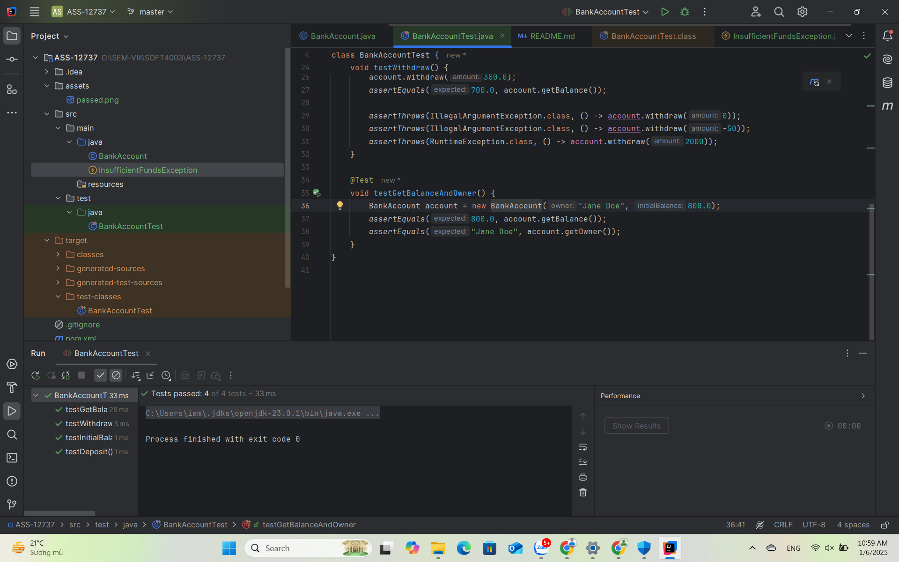

# Bank Account Management System

## **Author Information**
- **Name**: Tai Tran Viet
- **Student ID**: BIT220137
- **Email**: tvtai@cmcu.edu.vn


## Overview

The **BankAccount** project demonstrates the implementation of a simple banking system using Java. This project includes the `BankAccount` class and unit tests written using **JUnit 5** to validate its functionality.

---

## Features

The `BankAccount` class provides the following functionality:
1. **Account Management**:
    - Tracks account owner and balance.
2. **Deposit**:
    - Allows depositing funds with validation for non-negative amounts.
3. **Withdraw**:
    - Supports withdrawals with checks for sufficient balance and non-negative amounts.
4. **Query Balance and Owner**:
    - Retrieves the account balance and owner's name.

---

## Implementation Details

### **BankAccount Class**

The `BankAccount` class includes:

1. **Attributes**:
    - `balance`: A `double` representing the current account balance.
    - `owner`: A `String` representing the name of the account owner.

2. **Constructors**:
    - Initializes the account with an owner's name and an optional starting balance.
    - Throws an `IllegalArgumentException` if the starting balance is negative.

3. **Methods**:
    - `deposit(double amount)`: Adds funds to the account. Throws an exception if the amount is non-positive.
    - `withdraw(double amount)`: Deducts funds if the balance is sufficient. Throws exceptions for non-positive amounts or insufficient funds.
    - `getBalance()`: Returns the current balance.
    - `getOwner()`: Returns the account owner's name.

**Code Sample:**
```java
public class BankAccount {
    private double balance;
    private String owner;

    public BankAccount(String owner, double initialBalance) {
        if (initialBalance < 0) {
            throw new IllegalArgumentException("Initial balance cannot be negative.");
        }
        this.owner = owner;
        this.balance = initialBalance;
    }

    public void deposit(double amount) {
        if (amount <= 0) {
            throw new IllegalArgumentException("Deposit amount must be positive.");
        }
        balance += amount;
    }

    public void withdraw(double amount) {
        if (amount <= 0) {
            throw new IllegalArgumentException("Withdrawal amount must be positive.");
        }
        if (amount > balance) {
            throw new RuntimeException("Insufficient funds.");
        }
        balance -= amount;
    }

    public double getBalance() {
        return balance;
    }

    public String getOwner() {
        return owner;
    }
}
```

---

## Testing Details

Unit tests are written using **JUnit 5** to ensure the reliability of the `BankAccount` class. The tests validate key functionality, handle edge cases, and verify error handling.

### **Test Cases**

1. **Account Initialization**:
   - Verifies that the account initializes with the correct balance and owner name.
   - **Tests exception handling for negative initial balances** (e.g., `IllegalArgumentException`).

2. **Deposit**:
   - Validates the balance update after a deposit.
   - Ensures exceptions are thrown for zero or negative deposits.

3. **Withdraw**:
   - Validates the balance update after a withdrawal.
   - Tests exceptions for zero or negative withdrawals.
   - Checks exception handling for insufficient balance.

4. **Getters**:
   - Confirms that the `getBalance` and `getOwner` methods return the correct values.

**Test Code Sample (including negative initial balance test)**:
```java
import org.junit.jupiter.api.Test;
import static org.junit.jupiter.api.Assertions.*;

class BankAccountTest {

    @Test
    void testInitialBalance() {
        BankAccount account = new BankAccount("John Doe", 1000.0);
        assertEquals(1000.0, account.getBalance());
        assertEquals("John Doe", account.getOwner());
    }

    @Test
    void testInitialBalanceNegative() {
        // Checks exception is thrown when initial balance is negative
        assertThrows(IllegalArgumentException.class, () -> new BankAccount("Invalid User", -500.0));
    }

    @Test
    void testDeposit() {
        BankAccount account = new BankAccount("Jane Doe", 500.0);
        account.deposit(200.0);
        assertEquals(700.0, account.getBalance());

        assertThrows(IllegalArgumentException.class, () -> account.deposit(0));
        assertThrows(IllegalArgumentException.class, () -> account.deposit(-100));
    }

    @Test
    void testWithdraw() {
        BankAccount account = new BankAccount("John Doe", 1000.0);
        account.withdraw(300.0);
        assertEquals(700.0, account.getBalance());

        assertThrows(IllegalArgumentException.class, () -> account.withdraw(0));
        assertThrows(IllegalArgumentException.class, () -> account.withdraw(-50));
        assertThrows(RuntimeException.class, () -> account.withdraw(2000));
    }

    @Test
    void testGetBalanceAndOwner() {
        BankAccount account = new BankAccount("Jane Doe", 800.0);
        assertEquals(800.0, account.getBalance());
        assertEquals("Jane Doe", account.getOwner());
    }
}
```

---

## How to Run the Tests

1. **Prerequisites**:
   - Install Java Development Kit (JDK 8+).
   - Install Maven or Gradle.
   - Ensure JUnit 5 is included in the dependencies.

2. **Steps**:
   - Clone the repository.
   - Navigate to the project directory.
   - Run the tests using your build tool:
      - **Maven**: `mvn test`
      - **Gradle**: `gradle test`

3. **Expected Output**:
   - All tests should pass without errors, confirming the correctness of the implementation.

---

## Result



---

## ChatGPT

[Visit ChatGPT Share Link](https://chatgpt.com/share/677b5725-cb7c-8009-83a3-4936a84efeb8)

---

## License

This project is licensed under the MIT License.